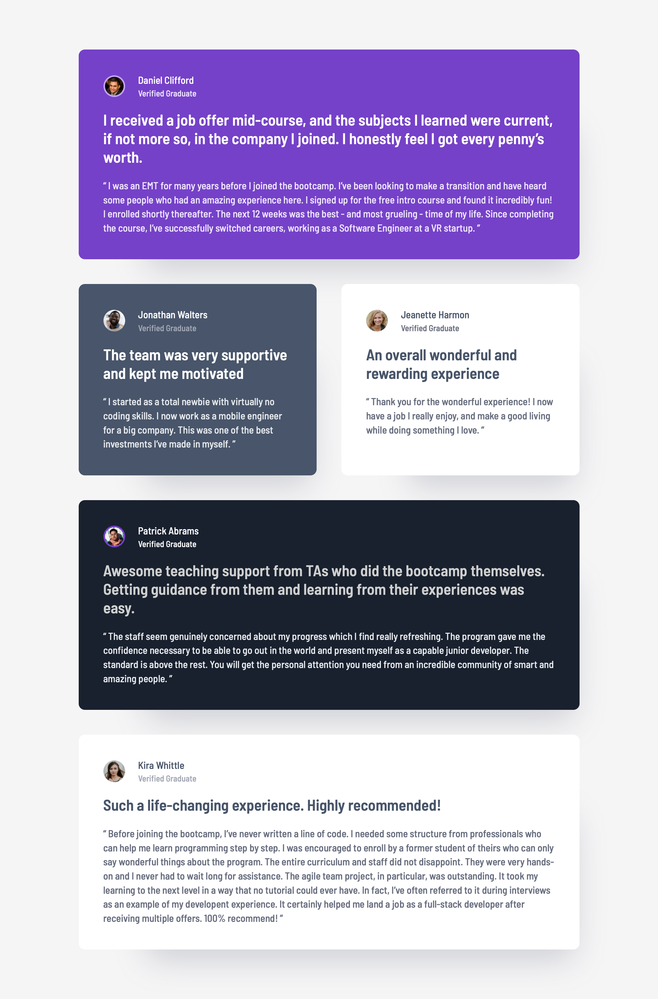
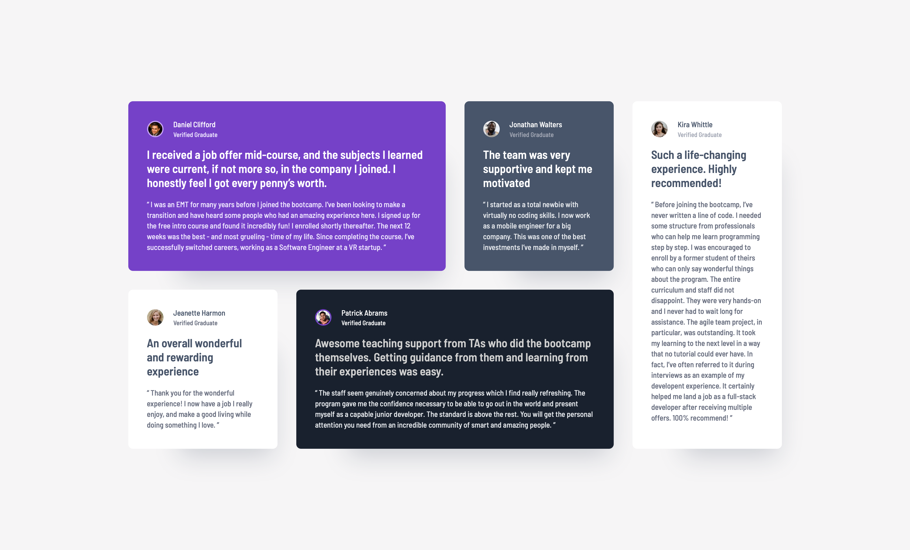

# Frontend Mentor - Testimonials grid section solution

This is a solution to the [Testimonials grid section challenge on Frontend Mentor](https://www.frontendmentor.io/challenges/testimonials-grid-section-Nnw6J7Un7). Frontend Mentor challenges help you improve your coding skills by building realistic projects.

## Table of contents

- [Overview](#overview)
  - [The challenge](#the-challenge)
  - [Screenshot](#screenshot)
  - [Links](#links)
- [My process](#my-process)
  - [Built with](#built-with)
  - [What I learned](#what-i-learned)
  - [Continued development](#continued-development)
  - [AI Collaboration](#ai-collaboration)
- [Author](#author)

## Overview

### The challenge

Users should be able to:

- View the optimal layout for the site depending on their device's screen size (mobile, tablet, and desktop)

### Screenshot





### Links

- Solution URL: [github.com/QusBee/testimonials](https://github.com/QusBee/testimonials)
- Live Site URL: [qusbee.github.io/testimonials](https://qusbee.github.io/testimonials)

## My process

### Built with

- Semantic HTML5 markup
- CSS custom properties
- Flexbox
- CSS Grid (including `grid-template-areas`)
- Mobile-first workflow

### What I learned

- **BEM modifiers vs. utility classes.** Background colors are tied to each card's position in the design (`content__section--1` … `--5`), since the color itself could change without the card moving. Text colors, on the other hand, repeat across completely different tags (`span`, `p`, `q`), so I pulled those into standalone utility classes (`text-white`, `text-grey-300`, etc.) that can be dropped onto any element instead of duplicating a color modifier per block.

- **`grid-area` only means something inside its matching `grid-template-areas`.** I first set `grid-area: section-1` (etc.) directly on the card classes with no media query around them, while `grid-template-areas` only existed inside `@media (min-width: 768px)`. On mobile, the browser had named-area placement rules pointing at areas that didn't exist there, and the layout broke. The fix was moving the `grid-area` declarations inside the same media query as the template that defines those names:

```css
@media (min-width: 768px) {
  .content__section--1 { grid-area: section-1; }
  /* ... */
  .content {
    grid-template-columns: 1fr 1fr;
    grid-template-areas:
      "section-1 section-1"
      "section-2 section-3"
      "section-4 section-4"
      "section-5 section-5";
  }
}
```

- **Accessible landmarks need headings.** Running the markup through the W3C validator flagged every `<section>` for lacking a heading. Rather than showing a visible title that isn't in the design, I added a visually-hidden `<h2>` per card (e.g. "Review by Daniel Clifford") plus a single hidden `<h1>` for the page — screen reader users get a real heading structure to navigate by, while the visual design stays untouched.

- **Not everything that looks fluid needs `clamp()`.** I initially assumed the growing space above the content block between the mobile and desktop mockups needed a fluid, viewport-based value. Checking the Figma frames directly showed no explicit margin was ever set on that block — the "growth" was just the effect of centering a fixed-height block inside a taller viewport with `display: flex; align-items: center;`. Reproducing it exactly with `clamp()` math would have solved a problem that didn't exist.

- **Rule out the boring explanations before debugging CSS.** A `max-width: 30.5rem` that measured as 505px, then 366px, in the browser wasn't a units bug — it was the page zoom level (120%, then a stale cache after a live-server restart). Checking zoom/cache first saved a lot of wasted time second-guessing correct code.

### Continued development

- Get more hands-on practice with fluid typography/spacing (`clamp()`, the Utopia fluid space calculator) on a project where the design actually calls for continuous scaling, rather than one where centering already does the job.
- Keep using the W3C validator and DevTools' grid overlay as a first debugging step before assuming the CSS logic itself is wrong.

### AI Collaboration

I used Claude (via Claude Code) throughout this project, guided by this challenge's `AGENTS.md`, which is set up to act as a mentor rather than write the code for me.

- Instead of finished CSS, I got guiding questions and was pointed at tools to check things myself — the W3C validator for the missing-heading warnings, DevTools for the zoom/cache mix-up, and Figma's own frame properties to confirm the "growing margin" was just centering.
- It helped explain the reasoning behind BEM modifiers vs. utility classes, and why `grid-area` needs to be scoped to the same media query as the `grid-template-areas` that defines it, before I wrote the fix myself.
- I also used it to help write this README, since English isn't my first language and I wanted the write-up to still be clear.

## Author

- Frontend Mentor - [@Qusbee](https://www.frontendmentor.io/profile/Qusbee)
- GitHub - [@Qusbee](https://github.com/Qusbee)
